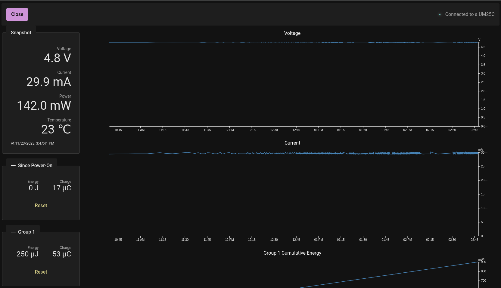

# Web Multimeter - Web Interface for UM-25C

This is a web frontend that doesn't require Python to run; it uses Web
Serial API to connect directly to the Bluetooth device.

This is a quick hack. It probably leaks memory, and it uses
Local Storage where it should use IndexedDB.



## Building

### Setup

Make sure to install the dependencies:

```bash
# npm
npm install

# pnpm
pnpm install

# yarn
yarn install

# bun
bun install
```

### Development Server

Start the development server on `http://localhost:3000`:

```bash
# npm
npm run dev

# pnpm
pnpm run dev

# yarn
yarn dev

# bun
bun run dev
```

### Production

Build the application for production:

```bash
# npm
npm run build

# pnpm
pnpm run build

# yarn
yarn build

# bun
bun run build
```

Locally preview production build:

```bash
# npm
npm run preview

# pnpm
pnpm run preview

# yarn
yarn preview

# bun
bun run preview
```

Check out the [deployment documentation](https://nuxt.com/docs/getting-started/deployment) for more information.

## See Also

* https://github.com/sebastianha/um34c for the reverse-engineered protocol.
